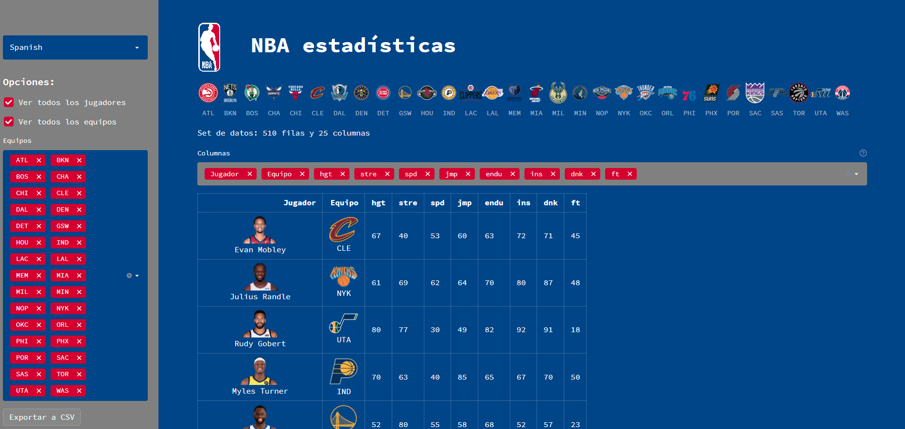
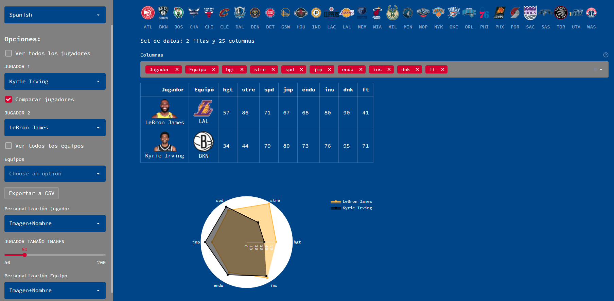
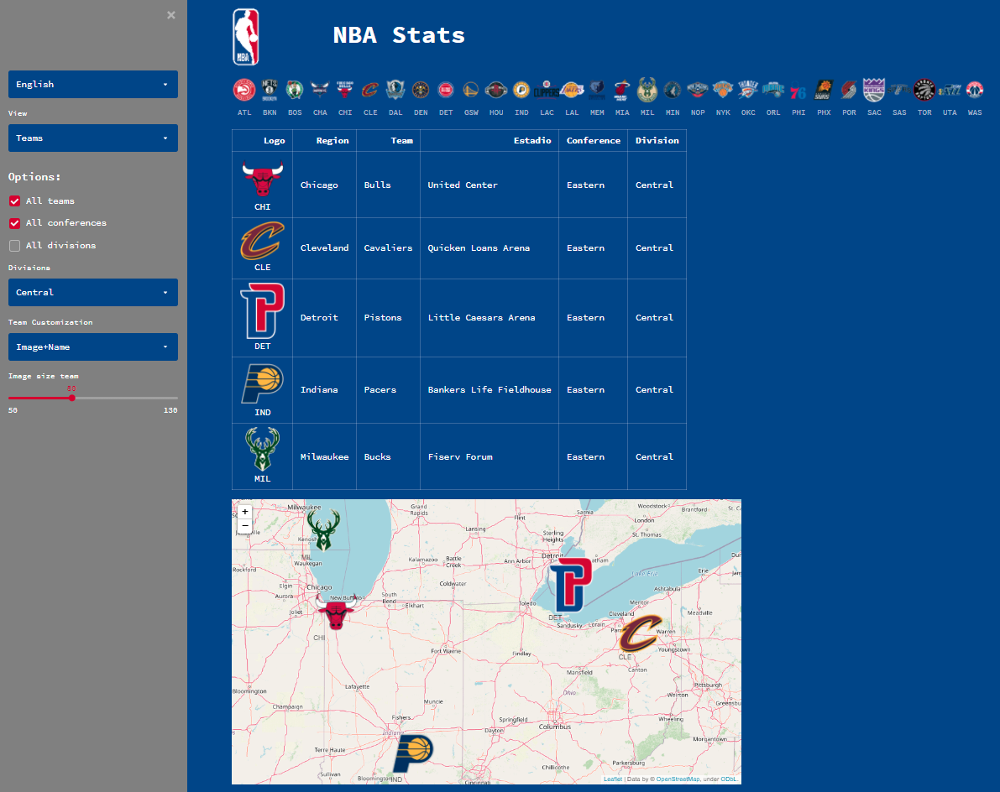

# :bar_chart: Demo streamlit para analisis de datos

[](https://share.streamlit.io/ezeparziale/hello-streamlit/app/nba_app.py)

Demo que utiliza datos de estadisticas de NBA








## :floppy_disk: Instalación

```shell
python -m venv env
```

```shell
source env/bin/activate
```

```shell
python.exe -m pip install --upgrade pip
```

```shell
pip install -r requirements.txt
```

## :running_man: Run

```shell
streamlit run app/nba_app.py
```

```http
http://localhost:8501
```

## :basketball: Funciones

- Listados de estadisticas completas de jugadores
- Logos de equipos
- Imagenes de jugadores
- Comparación entre jugadores
- Selector de imagen o texto en jugador
- Selector de imagen o texto en equipo
- Ajuste de tamaño de imagenes
- Selector de idioma Español e Ingles
- Exportación a CSV
- Publicación en streamlit cloud
- Selector de color en radar en función de los colores del equipo
- Selector de vista Jugardor
- Selector de vista Equipo
- Vista equipo con mapa
