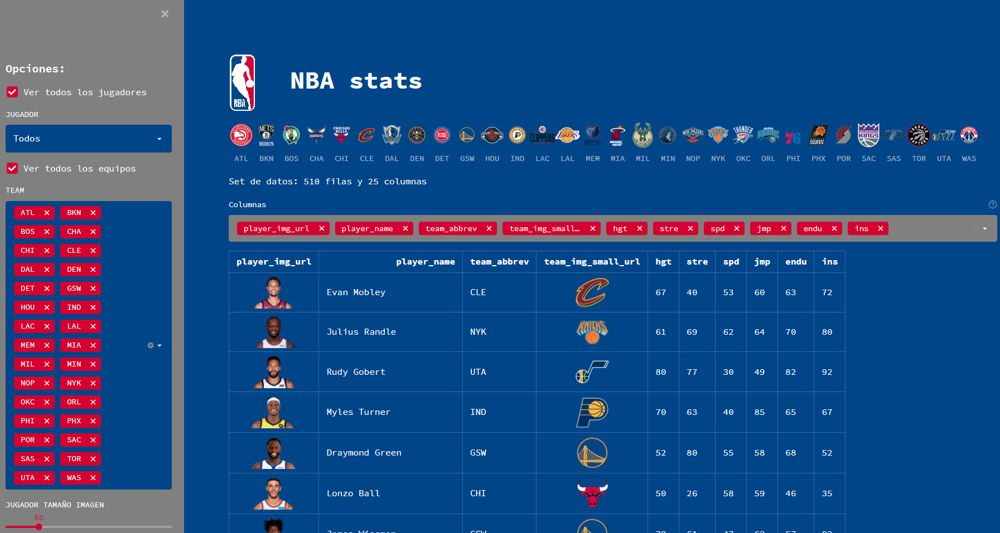

# Demo streamlit para analisis de datos

[]()  

Demo que utiliza datos de estadisticas de NBA



## :floppy_disk: Instalación

```shell
python -m venv env
```

```shell
source env/bin/activate
```

```shell
pip install -r requirements.txt
```

```shell
python.exe -m pip install --upgrade pip
```

## :running_man: Run

```shell
streamlit run app/nba_app.py
```

```http
http://localhost:8501
```
